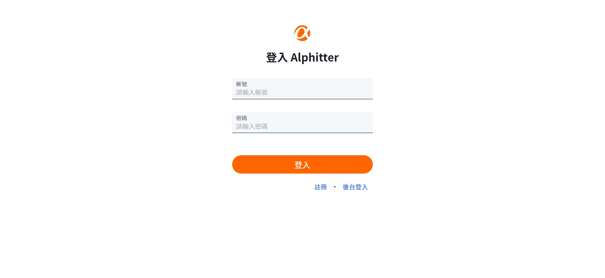
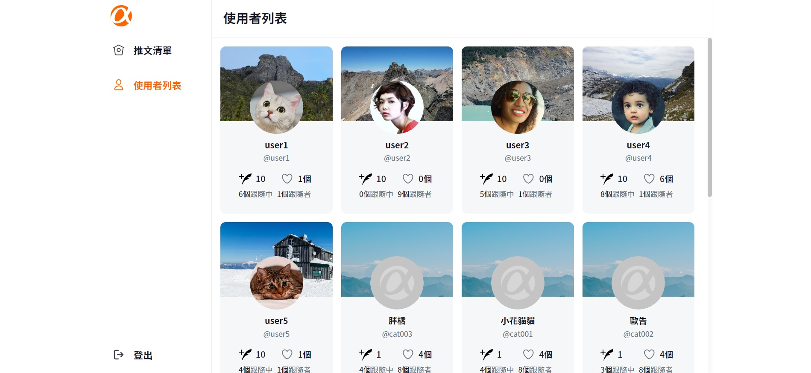
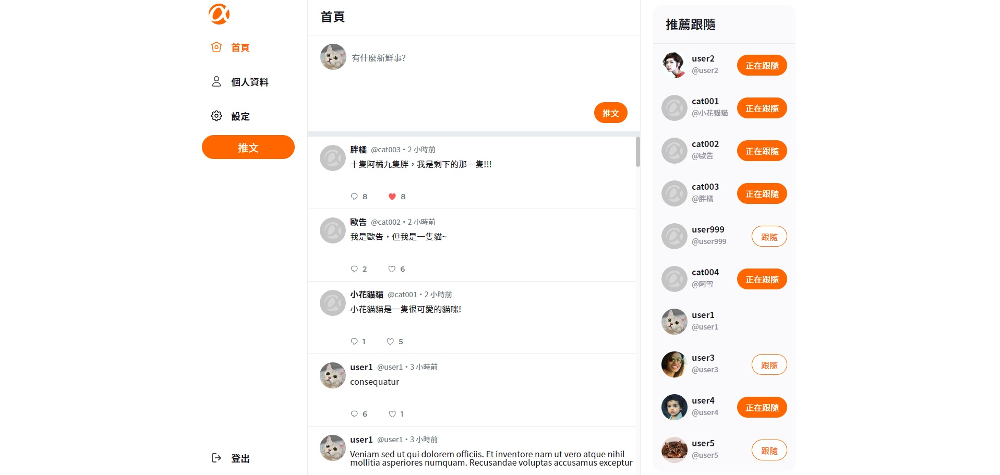
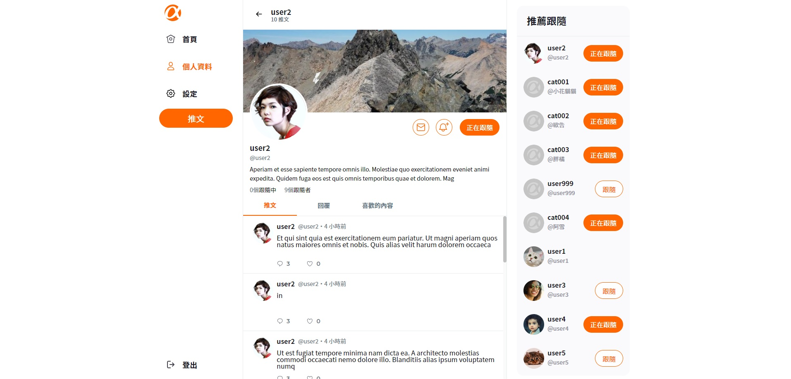
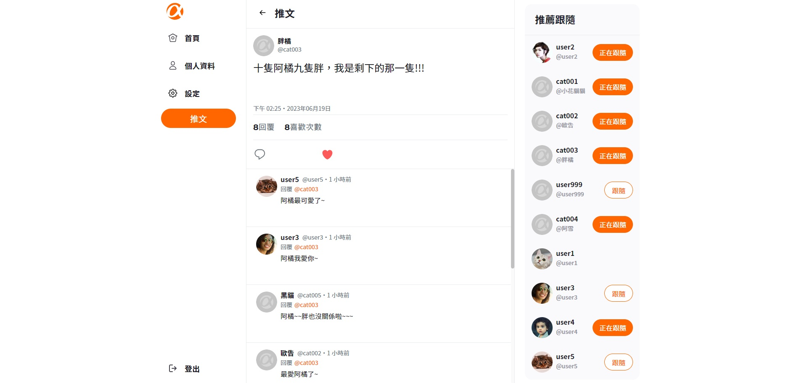

# Simple Twitter

這是一個使用 React 製作的簡易版推特，使用者可以註冊帳號，登入進行推文、案讚、追蹤等功能。 \
[gh-page 連結](https://magic9701.github.io/Simple-Twitter/)
[後端 repo 連結](https://github.com/av124773/twitter-api-2020)

## 畫面截圖







## 功能說明

### 前台功能

登入、註冊、修改個人資料、發文、瀏覽他人推文、回文、案讚、追蹤 \

### 後台功能

登入、瀏覽所有使用者資訊、瀏覽/刪除所有推文 \

## 使用說明

1. 確認有安裝 node.js、npm \
2. clone 專案 \
3. 使用終端機進入專案資料夾，輸入: \

```
 $ npm install
```

4. 啟動專案 \

```
 $ npm start
```

## 測試帳號

      前台使用者帳號：

      ```
      Account: user1
      Password: 12345678
      ```

      後台管理者帳號：

      ```
      Account: root
      Password: 12345678
      ```

## 使用工具

    "axios": "^1.4.0",
    "clsx": "^1.2.1",
    "gh-pages": "^4.0.0",
    "json-server": "^0.17.3",
    "jsonwebtoken": "^9.0.0",
    "react": "^18.2.0",
    "react-dom": "^18.2.0",
    "react-router-dom": "^6.4.1",
    "react-scripts": "5.0.1",
    "sweetalert2": "^11.6.4",
    "web-vitals": "^2.1.4"
    "sass": "^1.62.1"
